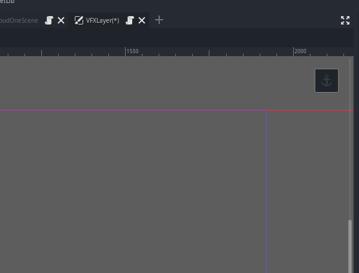
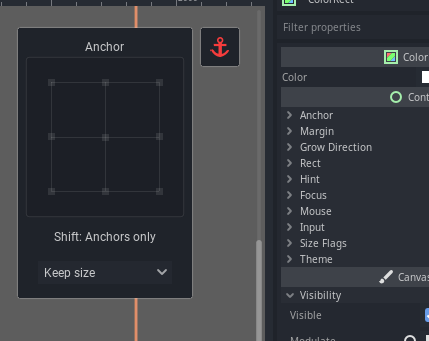
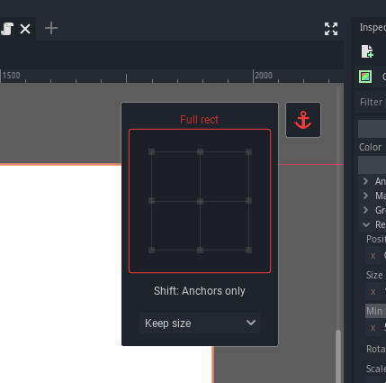
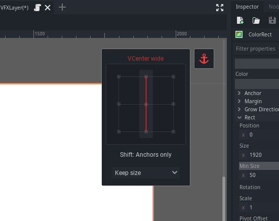

# Epic Anchors

## Introduction

This addon for the [Godot engine](https://godotengine.org/) optimizes setting the anchors and is based
on [this Godot proposal](https://github.com/godotengine/godot-proposals/issues/3559) by @lentsius-bark.

## Usage

* Install it from the Asset lib or unzip the release into your Godot project
* Enable the plugin

It will show an anchor icon in the top right corner of the editor viewport. 

Clicking on it will reveal the epic anchor widget.

See the [Godot proposal](https://github.com/godotengine/godot-proposals/issues/3559)
for details on how to use it.

For example, clicking the outer border will make your control use the complete
available space:

Selecting the middle line will arrange it in the center of the screen:

## Contributors

This plugin was originally created by [Krystof Klestil (lentsius-bark)](https://lentsius-bark.itch.io/)
with support of the community. It was contributed and released by Deep Entertainment into the asset lib.
